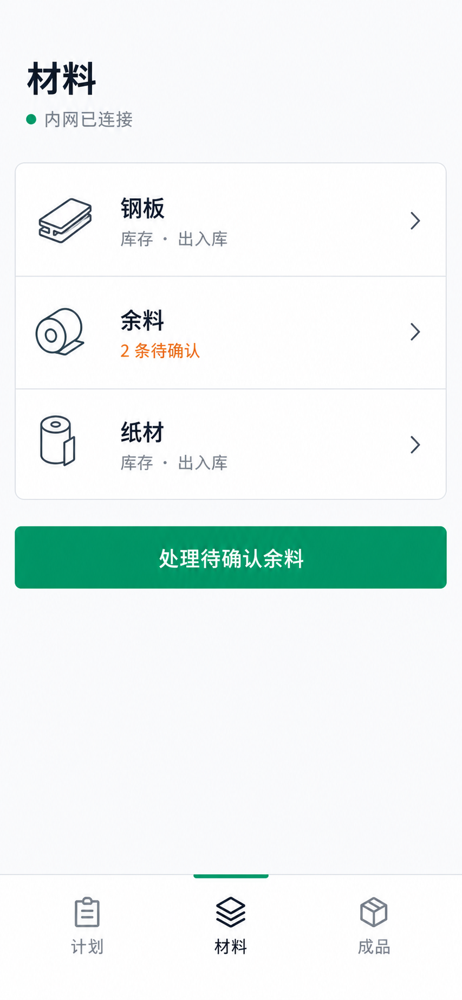

# 微信小程序前端精简重设计

## 1. 目标

在不改变现有业务接口、导航范围和库存规则的前提下，统一重设计杭州特耐时原生微信小程序前端。界面面向厂内车间员工，重点保证型号、尺寸、数量、库位和操作状态在手机上快速可读，并让用户单手完成查询、出入库和待确认处理。

本次采用用户确认的“分类优先、精简列表”方向。视觉锚点见：

## 2. 设计原则

- 简单优先：每屏只保留一个主任务和最多一个绿色主操作。
- 分类优先：一级页面用于选择计划、材料或成品；二级页面再承载查询和写操作。
- 列表优先：相关项目放在一个白色分组面内，以分隔线区分，不把每一行做成独立浮动卡片。
- 数据优先：型号、规格、数量、金额和日期使用等宽数字，允许完整换行，不以省略号隐藏关键业务信息。
- 状态明确：成功、待确认、失败和危险同时使用图标或文字，不仅依赖颜色。
- 触控优先：所有点击区域至少 `88rpx` 高，固定底栏与提交栏避让安全区。

## 3. 视觉系统

沿用现有工业化浅色体系，并减少阴影、圆角和装饰。

| 语义 | 颜色 | 用途 |
| --- | --- | --- |
| 页面底色 | `#F8FAFC` | 页面背景 |
| 内容面 | `#FFFFFF` | 分组列表、表单和弹层 |
| 主文字 | `#0F172A` | 页面标题、型号、关键数据 |
| 次文字 | `#64748B` | 说明、字段值和连接状态 |
| 边界 | `#E2E8F0` | 行分隔线、输入框和分组边界 |
| 主操作 | `#059669` | 每屏唯一主按钮、成功状态 |
| 待确认 | `#B45309` | 待处理数量和警告 |
| 危险 | `#DC2626` | 撤回、停用和失败 |

页面左右留白 `32rpx`，分组圆角不超过 `20rpx`，普通内容不使用阴影。字体使用小程序系统中文字体；页面标题 `44rpx/700`，行标题 `30rpx/600`，正文 `28–30rpx`，辅助文字 `26rpx`。

图标统一使用现有 Lucide 风格的圆角线性图标。分类图标控制在 `56–64rpx`，只作为识别辅助，不使用大面积插画、Emoji 或混合图标库。

## 4. 信息架构与页面范围

底部导航保持三个入口：`计划`、`材料`、`成品`。不增加新一级入口，也不恢复已隐藏的图纸管理入口。

本次统一以下现有已注册页面：

- 连接：连接检测、扫码连接、手工设置、失败恢复。
- 计划：计划首页与当前阶段说明；后续计划匹配功能沿用相同组件规范。
- 材料：材料首页、钢板占位首页、纸材占位首页。
- 余料：余料首页、待确认、库存、出库和流水。
- 成品：成品首页、库存、入库、出库和流水。

仍处于后续阶段的钢板、纸材和计划功能只重设计已有说明状态，不伪造尚未实现的写操作或数据。

## 5. 页面结构

### 5.1 一级首页

页面按以下顺序组成：

1. 页面标题。
2. 一行低强调连接状态，如“内网已连接”。连接失败时替换为可操作的错误条。
3. 一个白色分组列表，承载该模块的分类或常用入口。
4. 仅在存在明确待办时显示一个全宽主按钮。
5. 原生底部导航。

材料首页使用三行分组列表：钢板、余料、纸材。余料行直接显示“`n` 条待确认”，主按钮进入现有 `/pages/scraps/pending` 页面。钢板和纸材行进入对应现有页面。

成品首页保留可用数量，但缩减为一行关键数据，不再单独使用高阴影统计卡。库存、入库、出库和流水放入一个分组列表；尚未开放的分析入口使用清晰的禁用说明。

计划首页保留连接状态、页面标题和阶段说明。后续接入计划匹配时，首屏主操作固定为开始查料，不在首页堆叠所有筛选字段。

### 5.2 列表页

- 顶部由搜索框、筛选按钮和已选条件组成。
- 数据项使用一个连续列表面，行间以分隔线区分。
- 第一行显示型号或规格与状态；第二行显示材质、尺寸、库位；第三行突出数量和单位。
- 点击行主体进入详情；行内最多保留一个高频操作，其他操作进入详情页。
- 加载、空数据、筛选无结果、连接失败和服务错误分别使用明确状态文案。

### 5.3 表单页

- 采用单列字段，不使用并排输入。
- 标签常驻，placeholder 只提供示例。
- 数字字段使用对应数字键盘，错误紧邻字段显示。
- 提交按钮固定在底部安全区上方，并且是页面唯一绿色主操作。
- 提交前继续使用现有确认弹层逐项核对；提交中锁定按钮，结果不确定时先刷新库存和流水。

### 5.4 流水与危险操作

- 流水使用纵向事件行，先显示入库或出库类型与数量，再显示型号、时间、操作人和备注。
- 撤回入口低频展示并使用红色文字；点击后进入危险确认弹层。
- 撤回必须填写原因，取消入口始终可见。

## 6. 组件边界

现有 `connection-status`、`state-view` 和 `confirm-sheet` 继续复用，并统一视觉样式。新增或抽取的展示组件只负责视图，不复制业务规则：

- `section-list`：白色分组面、分隔线和统一行间距。
- `section-row`：图标、标题、辅助文案、状态和箭头。
- `primary-action`：全宽主按钮及安全区处理。
- `data-row`：型号、规格、数量和元数据的列表布局。

页面 JavaScript 保留现有请求、导航和状态管理方式。组件只接收页面准备好的显示字段并触发事件，不自行计算库存、重量、FIFO 或匹配结果。

## 7. 数据流与错误处理

页面加载仍通过现有 `utils/api.js` 请求后端。正常流程为：连接检查 → 加载页面数据 → 渲染列表或状态 → 用户发起写操作 → 确认弹层 → 带 `client_request_id` 提交 → 刷新相关库存和流水。

连接失败时不显示可执行库存写操作；后端错误保留当前数据并提供重试；写操作结果不确定时不得直接重复提交。视觉重设计不得改变现有幂等、FIFO、事务和撤回关系。

## 8. 响应式与无障碍

- 验收宽度包括 `375px`、常见安卓宽度和横屏，不允许横向滚动。
- 系统字号放大时，型号、尺寸、批次号和备注必须正常换行。
- 正文对比度不低于 WCAG AA。
- 触控目标至少 `88×88rpx`，相邻目标至少间隔 `16rpx`。
- 减少动态效果设置开启时，关闭非必要位移和缩放。

## 9. 测试与验收

- 更新静态契约测试，验证三入口、页面注册、主操作唯一性、触控尺寸和危险样式。
- 运行现有 Python 和 Node 测试，确认前端重构未改变接口契约或连接逻辑。
- 在微信开发者工具中逐页检查连接正常、加载、空数据、错误、待确认、提交中和确认弹层状态。
- 使用 `375px` 和至少一个常见安卓尺寸检查无截断、无遮挡和无横向滚动。
- 将材料首页实现截图与本规范的视觉锚点并排比较，重点检查层级、间距、字号、边界、圆角和主按钮。
- 真机抽查材料首页、余料待确认、成品入库和流水四条核心路径。

## 10. 非目标

- 不新增登录、角色权限、云服务、离线写入、扫码库存标签或新业务接口。
- 不实现尚处于后续阶段的钢板、纸材或计划完整业务功能。
- 不修改后端库存计算、数据模型、排序、幂等或撤回规则。
- 不新增页面路由，不恢复图纸管理入口。
